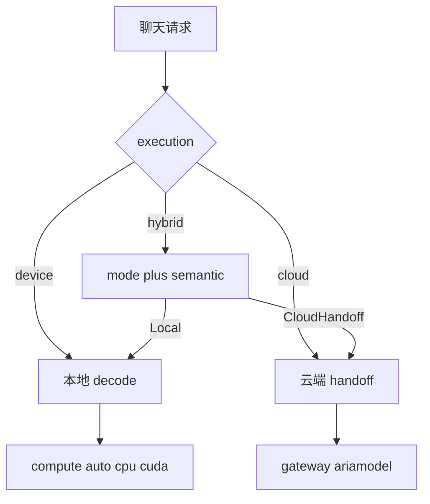

# engine

[English](README.md) | [中文](README_cn.md)

Aria Compute 推理引擎：OpenAI 兼容 API、Aria bundle 推理、零拷贝计算图、ARM NEON / scalar 内核、Hybrid 路由。

## 构建 / 测试

```bash
cargo test
cargo clippy --workspace --all-targets -- -D warnings
```

## 配置 / 运行

凭证与 hybrid 偏好保存在 `~/.ariacompute/config.yml`（通过 `aria-engine auth` 写入）。

| 字段 | 含义 | 默认 |
|------|------|------|
| `cloud_api_key` | Hybrid Bearer 密钥 | _(空 → 云调用报错)_ |
| `cloud_url` | Gateway base URL（由 API key 所属区域自动探测） | — |
| `site_url` | 下载用站点（与 `cloud_url` 同区） | — |
| `upgrade_url` | CLI/FFI 升级组织根（`.com`→GitHub，`.cn`→Gitee） | — |
| `hybrid_mode` | `cost` / `balance` / `intelligence` | `balance` |
| `hybrid_execution` | `hybrid` / `device` / `cloud` | `hybrid` |
| `hybrid_semantic` | 语义路由层开关（无云凭证时自动短路） | `true` |
| `hybrid_semantic_timeout_ms` | 语义路由单次调用超时 | `800` |
| `hybrid_semantic_cache_size` | 语义决策缓存容量（TTL 60s） | `512` |
| `compute` | `auto` / `cpu` / `cuda`（本机 GEMM；**不是** hybrid 开关） | `auto` |
| `hf_token` | Hugging Face hub token（可选；`.com` 需授权文件） | _(空)_ |
| `modelscope_api_token` | ModelScope hub token（可选；`.cn` 需授权文件） | _(空)_ |

```bash
# 认证
aria-engine auth
aria-engine auth --status

# 下载模型
# 可选：aria-engine auth 按区提示 hf_token（.com）或 modelscope_api_token（.cn）
aria-engine download gemma-4-e2b-it_q4
aria-engine list
aria-engine check gemma-4-e2b-it_q4
# 或：aria-engine check   # 校验全部本地缓存
aria-engine clean gemma-4-e2b-it_q4

# 升级 CLI + libaria_ffi（最新正式版，或指定版本）
# FFI 安装到 ~/.ariacompute/lib/，必要时设置 ARIA_FFI_LIB
aria-engine upgrade
aria-engine upgrade 0.7.2

# 服务
# 或：serve /path/to/aria-bundle
aria-engine serve gemma-4-e2b-it_q4 \
  --bind 127.0.0.1:8080 \
  --hybrid-mode balance \
  --hybrid-execution hybrid \
  --compute auto
```

`download` 每次运行只探测**本区**公开 hub（`.com`→Hugging Face，`.cn`→ModelScope）。私有/需授权的 hub 文件在未配置 token 时会报 `auth failed HTTP 401`：用 `aria-engine auth` 按区写入对应 token（`.com` → `hf_token`，`.cn` → `modelscope_api_token`）到 `~/.ariacompute/config.yml`。

`list` 查询 `{site_url}/api/dashboard/models`（需先 `aria-engine auth`），按可下载 bundle 列出并标记 `downloaded` / `not downloaded`（另附仅本地缓存项）。

`check [model]` 对照本区 hub（与 `download` 相同）校验本地文件数目、文件名与 SHA-256；省略 model 则检查全部缓存。不一致 exit 1；`weight.bin` 只在本地哈希并与 hub 元数据比对，不重新下载。

`serve` 旗标仅覆盖本进程配置（不回写文件）。`serve <model>`：若为现存路径则用之，否则使用 `~/.ariacompute/models/<model>`。

`--hybrid-execution` 只控制云 handoff（`device` 永不离机）。`--compute auto|cpu|cuda` 选择**本机** GEMM：`auto` 在能加载 `libcudart`/`libcublas` 且 `cudaGetDeviceCount>0` 时用 CUDA，否则 CPU（x86_64 AVX2+FMA，aarch64 NEON）。`--compute cuda` 在无 NVIDIA 设备时**硬失败**，不会静默降到 CPU。CUDA 为运行时 libloading（编译不依赖 CUDA toolkit）；H200 上仍可用 `--features cuda` 作为文档旗标：

```bash
cargo build -p aria-openai --release --features cuda
aria-engine serve qwen3-0.6b_q4 --hybrid-execution device --compute auto --profile
```

`--profile` 记录加载/生成分段计时。用 `GET /v1/engine/profile` 读取，或：

```bash
python scripts/profile_qwen3_serve.py --compute cpu --spawn --report ./out/engine_profile_qwen3.json
```

路由是两层正交轴（本机算力 vs 端云路由）：



**`compute`（`auto|cpu|cuda`）不是 hybrid 开关**——只决定 **本地 decode** 的 GEMM。`execution=cloud` 时仍加载本地 bundle（隐私硬约束会回本地），成功 handoff 不走 CUDA。

**`execution`（`device|hybrid|cloud`）** 决定允许的后端：`device` 永不离机；`cloud` 始终 handoff（不可用则报错，不静默本地）；`hybrid` 按 mode + semantic 在 Local / Cloud 之间选择。**`mode`（`cost|balance|intelligence`）仅在 `hybrid` 下生效**：调节复杂度 cutoff 与 Chat 策略。Cost 的知识类 Chat 咨询语义层；Balance/Intelligence 的 Chat 规则直云（`rule:chat_prefer_cloud`，`model: "ariacompute/ariamodel"`）。**`semantic` 仅在 `execution=hybrid`、有云凭证且开关 on 时生效。** 规则只对 Agent / 长上下文 / 复杂度邻域 / Cost 的 Chat 提问。问候、硬约束、Balance Chat 直云都不问。`cloud_available=false` 时 hybrid 全部留本地（含 Chat），semantic 短路。

serve 日志与 `GET /v1/engine/routes` 打印**生效**策略（非 hybrid 时 `mode=unused`；`semantic=on|off|n/a`——开关无法开火时为 `n/a`）。用户消息包含 `FORCE_CLOUD` 可强制走云端（测试 / 演示）。客户端设置了 `max_tokens` 则本地 decode 与云端 handoff 都原样使用；未设置时本地跑到 stop 或剩余 context，云端省略该字段。云端 handoff 的 `model` 固定为 `ariacompute/ariamodel`。HTTP 等待上限为 `DEFAULT_CLOUD_CHAT_TIMEOUT_MS`（**60s**，编译期常量；不是 `hybrid_semantic_timeout_ms`）。带 reasoning 的完整 `ariamodel` 回复可能超过 25s。

语义慢路径经云网关获取结构化 JSON 意图决策（`enable_thinking=false`、缓存 60s、单次 ≤800ms）。语义层关闭 / 超时 / 失败时静默回退规则层，不报错。后端健康分（成功 / 失败 / 超时）驱动回退翻转；硬约束（device / 隐私）永不翻转。经 `GET /v1/engine/routes?n=20` 查看最近决策与健康分；`--hybrid-semantic off` 可按进程关闭语义层。

## OpenAI API

假设服务在 `http://127.0.0.1:8080`：

```bash
# 列出模型
curl -s http://127.0.0.1:8080/v1/models | jq .

# 加载 / 生成分段计时（需 serve --profile）
curl -s http://127.0.0.1:8080/v1/engine/profile | jq .

# Chat（非流式）
curl -s http://127.0.0.1:8080/v1/chat/completions \
  -H 'content-type: application/json' \
  -d '{
    "messages":[{"role":"user","content":"Hello"}],
    "temperature": 0
  }' | jq .

# Chat（SSE 流式）
curl -sN http://127.0.0.1:8080/v1/chat/completions \
  -H 'content-type: application/json' \
  -d '{
    "messages":[{"role":"user","content":"Hello"}],
    "stream": true
  }'

# Embeddings
curl -s http://127.0.0.1:8080/v1/embeddings \
  -H 'content-type: application/json' \
  -d '{"input":"hello embedding"}' | jq .

# ASR stub（PCM16 LE 字节，base64）
curl -s http://127.0.0.1:8080/v1/audio/transcriptions \
  -H 'content-type: application/json' \
  -d '{"file_b64":"AAECAwQFBgc="}' | jq .
```

## Qwen3 对话诊断

当 `/v1/chat/completions` 乱码（例如 Hello → `"olum啦…"`）但同一份 Aria bundle 在 HF 上正常时，用这一对脚本拆分问题。两侧共用同一段 ChatML（`enable_thinking=False` / 空 `<think>`），默认 user `Hello`，greedy `max_tokens=32`。

| 脚本 | 隔离什么 |
|------|----------|
| [`../model/scripts/diag_qwen3_chat.py`](../model/scripts/diag_qwen3_chat.py) | **量化 + 模板**：HF fp32 vs 把 `reconstruct_weight` 注入同一张 HF 图 |
| [`scripts/diag_qwen3_chat.py`](scripts/diag_qwen3_chat.py) | **引擎图**：本服务 vs model 侧 JSON（`--peer-report`） |

**1. model 教师**（并列的 `model` 仓库；建议 GPU；tokenizer 从 `--hf` 加载，不用 bundle 里的）：

```bash
# 在 ../model
pip install torch transformers
python scripts/diag_qwen3_chat.py \
  --bundle ~/.ariacompute/models/qwen3-0.6b_q4 \
  --hf Qwen/Qwen3-0.6B \
  --device cuda \
  --report ./out/model_diag_qwen3.json
```

`--device auto` 在有 CUDA 时选用 GPU。Attention 走 eager（关闭 hub CUDA JIT）。若仍编译失败：`sudo apt install python3-dev`。

对照 `chat.fp32` 与 `chat.reconstruct`，以及 `template_string_match` / `prompt_ids_match`。若 reconstruct 已能打出类似 `"Hello! How can I assist you today?"` 且 `exact_prefix_len >= 4`，说明 **bundle 在 HF 上可用**，引擎乱码不是量化问题。

**2. engine**（必须 `serve` **同一份** bundle，且不走云 handoff）：

```bash
# 在本仓库；用 --hybrid-execution device，避免 hybrid 掩盖本地 decode
./aria-engine serve qwen3-0.6b_q4 \
  --bind 127.0.0.1:8080 \
  --hybrid-execution device \
  --compute auto --profile
python scripts/diag_qwen3_chat.py \
  --url http://127.0.0.1:8080 \
  --bundle ~/.ariacompute/models/qwen3-0.6b_q4 \
  --peer-report ../model/out/model_diag_qwen3.json \
  --report ./out/engine_diag_qwen3.json
```

`--timeout` 默认 300s（CPU decode 可能很慢）。可选 `pip install tokenizers`，以便用 `bundle/tokenizer.json` 编 prompt ids。

**如何读 `hints`**

| 现象 | 更可能的原因 |
|------|----------------|
| `template_string_match` / `prompt_ids_match` 为 false | ChatML / tokenizer 编码不一致 |
| reconstruct greedy 已相对 fp32 发散（`QUANT:…`） | 码本 / Hadamard / 注入 |
| reconstruct 对话正常，引擎 `content` 仍乱（`ENGINE_GRAPH`） | Rust 前向（HDM、embed 按行取值、RoPE、QK-norm 等） |

引擎的教师信号是 **HF + reconstruct 注入**，不是裸 fp32。更多说明见 [`../model/README_cn.md`](../model/README_cn.md)（质量审计）。

## Gemma-4 对话诊断

当 `gemma-4-e2b-it_q4` 的 `/v1/chat/completions` 乱码（`engine.log` Hello → `"uhnyaчь…"`），而同机 Qwen3 已正常时，用这一对脚本拆分。两侧共用 `gemma4_it`（`<bos><|turn>user…<turn|>\n<|turn>model\n`），默认 user `Hello`，greedy `max_tokens=32`。官方 Hello prompt 为 **10** token。

| 脚本 | 隔离什么 |
|------|----------|
| [`../model/scripts/diag_gemma4_chat.py`](../model/scripts/diag_gemma4_chat.py) | **量化 + 模板**：HF fp32 vs 把 `reconstruct_weight` 注入同一张 HF 图 |
| [`scripts/diag_gemma4_chat.py`](scripts/diag_gemma4_chat.py) | **引擎图**：本服务 vs model 侧 JSON（`--peer-report`） |

**1. model 教师**（并列的 `model` 仓库；建议 GPU）：

```bash
# 在 ../model
pip install torch transformers
python scripts/diag_gemma4_chat.py \
  --bundle ~/.ariacompute/models/gemma-4-e2b-it_q4 \
  --hf google/gemma-4-E2B-it \
  --device cuda \
  --report ./out/model_diag_gemma4.json
```

**2. engine**（必须 `serve` **同一份** bundle，且不走云 handoff）：

```bash
# 在本仓库；用 --hybrid-execution device，避免 hybrid 掩盖本地 decode
./aria-engine serve gemma-4-e2b-it_q4 \
  --bind 127.0.0.1:8080 \
  --hybrid-execution device \
  --compute auto --profile
python scripts/diag_gemma4_chat.py \
  --url http://127.0.0.1:8080 \
  --bundle ~/.ariacompute/models/gemma-4-e2b-it_q4 \
  --peer-report ../model/out/model_diag_gemma4.json \
  --report ./out/engine_diag_gemma4.json
```

`hints` 读法与 Qwen3 相同（`TEMPLATE` / `QUANT` / `ENGINE_GRAPH`）。Hello 的 `prompt_tokens` 在 Gemma-4 `<|turn>` 模板下应为 **10**。

## 评测（Bench）

```bash
# 请自行启动各后端服务，然后：
python -m unittest discover -s bench/tests -t .
python -m bench list-families
python -m bench run \
  --backend aria=http://127.0.0.1:8080 \
  --backend llamacpp=http://127.0.0.1:8081 \
  --backend ollama=http://127.0.0.1:11434 \
  --backend vllm=http://127.0.0.1:8000 \
  --backend sglang=http://127.0.0.1:30000 \
  --max-tokens 64 --warmup 1 --runs 3 \
  --report ./out/bench_report.json
# 同时会写入 ./out/bench_report.md
```

可用 `--model-id family=path=id` 或 `backend:family=id` 覆盖模型 id。aria 默认使用家族 path；其余后端默认使用 HF `base_model`。

## SDK Bindings

原生 C ABI（`ariacompute-ffi` / `libaria_ffi`）与 `bindings/` 下薄封装

| Binding | 路径 | Registry |
|---------|------|----------|
| Rust | `bindings/rust`（`ariacompute-engine`） | crates.io |
| Python | `bindings/python` | PyPI |
| Go | `bindings/go` | Go module |
| TypeScript | `bindings/typescript` | npm `@ariacompute/engine-ts` |
| React Native | `bindings/react-native` | npm `@ariacompute/engine-rn` |
| Flutter | `bindings/flutter` | pub.dev |
| Swift | `bindings/swift` | CocoaPods |
| Kotlin | `bindings/kotlin` | Maven |

C 头文件：[`ffi/include/aria.h`](ffi/include/aria.h) — `aria_model_init`、`aria_complete` / stream、`aria_embed`、`aria_transcribe`、tools JSON、`aria_model_destroy`、`aria_last_error`。新增自动下载辅助：`aria_model_cache_dir(model)`（返回 `~/.ariacompute/models/{model}`）与 `aria_is_local_path(ref)`（1=本地路径，0=模型名，-1=错误）。

### 按模型名自动下载

所有语言 SDK 现在同时接受**本地 bundle 路径**或 **Aria 模型名**。含 `/`（或本地已存在）的值视为本地路径直接加载；否则视为模型名，由 SDK 从 **Dashboard 私有源** 自动下载（需传入 dashboard `token`；`site_url` 默认 `https://ariacompute.com`，可用 `site`/环境变量覆盖）。下载逻辑与 `aria-engine download` 的 Dashboard 分支一致：解析 `slug`/`quant`、请求 meta URL、流式拉取 zip、校验 zip 魔数、解压（flatten 单层子目录）、校验 `weight.bin` + `config.json` 且 `format == "aria-quant-bundle"`。缓存中已存在有效 bundle 时直接复用、不重复下载。下载失败抛出明确错误——绝不静默吞掉。

```bash
cargo test -p ariacompute-ffi -p ariacompute-engine
./scripts/run-binding-tests.sh   # 主机矩阵（Rust / Python / Go / TS）
```

移动端 e2e（Flutter + React Native，iOS + Android）：[`.github/workflows/bindings-mobile.yml`](.github/workflows/bindings-mobile.yml)。

### libaria_ffi（Release 资产）

每次 GitHub Release，[`.github/workflows/release.yml`](.github/workflows/release.yml) 会在 CLI 包之外上传各平台归档：

| 资产 | 内容 |
|------|------|
| `libaria_ffi_<ver>_linux_x86_64.tar.gz` | `libaria_ffi.so` |
| `libaria_ffi_<ver>_linux_arm64.tar.gz` | `libaria_ffi.so` |
| `libaria_ffi_<ver>_macos.tar.gz` | `libaria_ffi.dylib` |
| `libaria_ffi_<ver>_windows_x86_64.tar.gz` | `aria_ffi.dll`（及可选 import lib） |

```bash
# 示例：Linux x86_64
tar -xzf libaria_ffi_0.7.1_linux_x86_64.tar.gz
export ARIA_FFI_LIB="$PWD/libaria_ffi.so"
# 可选：export LD_LIBRARY_PATH="$PWD:${LD_LIBRARY_PATH:-}"
```

绑定还需本地 Aria bundle（`weight.bin` + `config.json` + tokenizer），例如经 `aria-engine download …` 落到 `~/.ariacompute/models/`。

### 示例

**Python**（通过 `ARIA_FFI_LIB` 加载 `libaria_ffi`）：

```bash
export ARIA_FFI_LIB=/path/to/libaria_ffi.so
pip install aria-engine
```

```python
from aria_engine import Engine

# 本地 bundle 路径：
with Engine("/path/to/aria-bundle") as eng:
    out = eng.complete(
        [{"role": "user", "content": "Hello"}],
        {"max_tokens": 32},
    )
    print(out["response"])
    # 也可：eng.embed("hi"), eng.transcribe(pcm_bytes)

# 或按模型名 —— 自动从 Dashboard 下载（需要 api token）：
with Engine("gemma-4-e2b-it_q4", token="<api_token>") as eng:
    print(eng.complete([{"role": "user", "content": "Hello"}], {"max_tokens": 32})["response"])
```

**TypeScript / Node**（`@ariacompute/engine-ts`）：

```bash
export ARIA_FFI_LIB=/path/to/libaria_ffi.so
npm install @ariacompute/engine-ts
```

```ts
import { Engine } from "@ariacompute/engine-ts";

// 本地 bundle 路径：
const eng = new Engine("/path/to/aria-bundle");
const out = eng.complete(
  [{ role: "user", content: "Hello" }],
  { max_tokens: 32 },
);
console.log(out.response);
eng.close();

// 或按模型名 —— 自动从 Dashboard 下载（需要 token）：
const eng2 = await Engine.open("gemma-4-e2b-it_q4", { token: "<api_token>" });
console.log((await eng2.complete([{ role: "user", content: "Hello" }])).response);
eng2.close();
```

**Go**（cgo；链接 `libaria_ffi`）：

```bash
export ARIA_FFI_LIB=/path/to/libaria_ffi.so
export CGO_ENABLED=1
# 确保链接器能找到该库（或在模块 cgo 中指定 -L）。
go get github.com/ariacompute/engine/bindings/go@latest
```

```go
package main

import (
	"fmt"
	aria "github.com/ariacompute/engine/bindings/go"
)

func main() {
	// 本地 bundle 路径：
	eng, err := aria.Open("/path/to/aria-bundle")
	if err != nil {
		panic(err)
	}
	defer eng.Close()
	out, err := eng.Complete(
		[]map[string]string{{"role": "user", "content": "Hello"}},
		map[string]any{"max_tokens": 32},
		nil,
	)
	if err != nil {
		panic(err)
	}
	fmt.Println(out["response"])

	// 或按模型名 —— 自动从 Dashboard 下载（需要 token）：
	eng2, err := aria.OpenModel("gemma-4-e2b-it_q4", "<api_token>", "")
	if err != nil {
		panic(err)
	}
	defer eng2.Close()
	_ = eng2
}
```

**Rust**（`ariacompute-engine` crate — 原生 API；一般无需解压 `libaria_ffi`）：

```bash
cargo add ariacompute-engine
```

```rust
use aria_engine::{Engine, GenerateOpts, OpenOptions};

fn main() -> Result<(), Box<dyn std::error::Error>> {
    // 本地 bundle 路径：
    let mut eng = Engine::open("/path/to/aria-bundle")?;
    let g = eng.complete("Hello", &GenerateOpts {
        max_tokens: 32,
        temperature: 0.0,
    })?;
    println!("{}", g.text);

    // 或按模型名 —— 自动从 Dashboard 下载（需要 token）：
    let opts = OpenOptions {
        token: Some("<api_token>".into()),
        site: None,
    };
    let mut eng2 = Engine::open_model("gemma-4-e2b-it_q4", &opts)?;
    let g2 = eng2.complete("Hello", &GenerateOpts { max_tokens: 32, temperature: 0.0 })?;
    println!("{}", g2.text);
    Ok(())
}
```

各语言更多说明见 `bindings/*/README.md`。

### 从各 Registry 安装

创建 **GitHub Release** — [`.github/workflows/release.yml`](.github/workflows/release.yml) 构建 CLI + `libaria_ffi` 包并尝试发布语言包（npm / pub.dev / Maven / CocoaPods / crates.io / PyPI）。**发布失败为 fail-pass**，不阻塞 CLI / `libaria_ffi` 资产。crates.io（`ariacompute-engine`）由 [`.github/workflows/publish-cargo.yml`](.github/workflows/publish-cargo.yml) 发布。所需 secrets：`NPM_TOKEN`、pub 凭证、Maven + GPG、`COCOAPODS_TRUNK_TOKEN`、`CARGO_REGISTRY_TOKEN`、`PYPI_TOKEN`，以及 Release 上传用的 `ARIACOMPUTE_TOKEN`。

版本 = release tag 去掉前导 `v`。

## 工程约定

本仓库遵循 Harness Engineering 理念：

- [`AGENTS.md`](AGENTS.md)：Agent 工程上下文入口与目录索引
- [`requirements.md`](requirements.md)：需求 Spec（功能边界 / 例外 / 验收标准，需人工审核）
- [`task.md`](task.md)：实施任务清单
